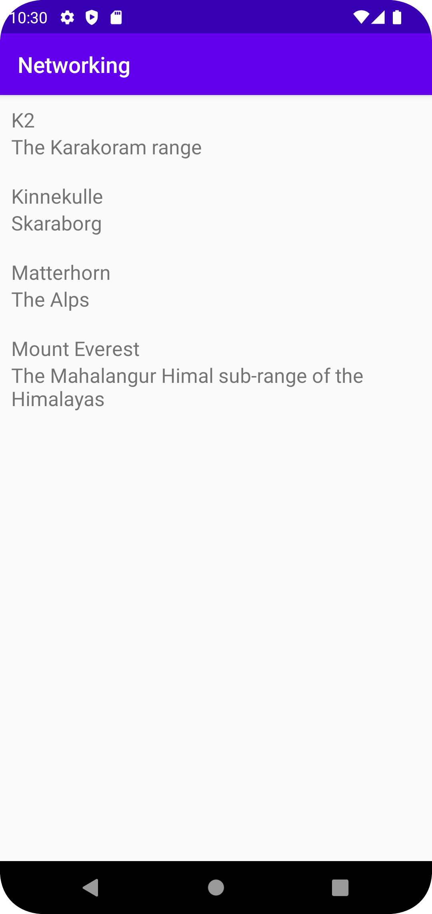

# Rapport
Jag började med att lägga till en recyclerview widget till min main layout för att sedan skapa en ny layout med en linearlayout innhållandes två textviews som vertikalt ska kunna visa bergsnamn och deras platser. Sedan skapade jag en ny javaklass för Mountain med fält, constructors och metoder som t.ex. getters och setters. När jag var klar med det testade jag att manuellt lägga in tre berg i en arraylist i onCreate. Här skapade jag även en ny instans av en RecyclerViewAdapter som jag sedan även gjorde en egen klass för. I den här klassen använde jag sedan metoderna som medföljde tillsammans med Mountains getters. Jag kopplade även ViewHoldern i RecyclerViewAdaptern till textviewsen i min egna layout. När jag lyckats få adaptern att läsa min arraylist och visa bergen på skärmen testade jag att istället med hjälp av gson omvandla jsonfilen till en lista och ritade ut den på skärmen istället. Slutligen tillät jag internetåtkomst i manifestfilen och kopplade URLn för kända berg och implementerade en updateData-metod i adaptern vilken sedan kallades i onPostExecute för att visa topparna från URLn.

```
public void updateData (List<Mountain> newMountainList) {
        Log.d("T", "TEST");
        items.clear();
        items.addAll(newMountainList);
        notifyDataSetChanged();
}
```
I kodexemplet ovan tar metoden updateData emot en lista av bergsobjekt. Log.d är en debuggningsmetod där ett debugmeddelande skrivs ut i programmets log.
Det här är något som kan användas för att se att metoden anropas. items.clear tömmer listan på items (mountains) och items.addAll lägger sedan till 
bergen från listan som tagits emot av metoden. notifyDataSetChanged anropar en metod som säger till att recyclerViewn behöver uppdateras med den senaste datan.


